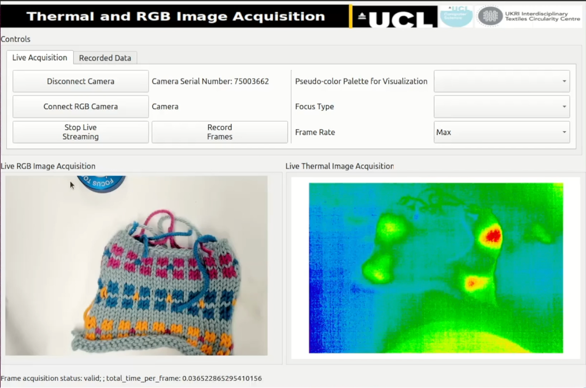

# TCC RGB+T Fusion data collection & visualisation software
## project code: rgbt_seg_live (public release date: 5 March 2025)
Real time capture of RGB and thermal images, along with inference for semantic segmentation.

## User Interface for TCC RGB+T Fusion Data Collection & Visualisation Software

### Acknowledgement: This project was funded by the Engineering and Physical Sciences Research Council (EP/V011766/1) for the UK Research and Innovation (UKRI) Interdisciplinary Circular Economy Centre for Textiles: Circular Bioeconomy for Textile Materials.
